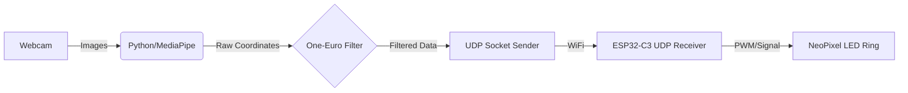

# 🖐️ Smart Light Controlled by Gesture Recognition

 

## 🚀 Giới thiệu (Introduction)

Dự án này được xây dựng nhằm mục đích nghiên cứu về **Computer Vision** và ứng dụng **AI** trong IoT, với sự hỗ trợ của trợ lý AI (Gemini). Hệ thống sử dụng thư viện **MediaPipe** để trích xuất tọa độ bàn tay, áp dụng các **thuật toán lọc nhiễu tín hiệu số** để xử lý dữ liệu.

---

> **Tính năng nổi bật:**
> * Tracking bàn tay thời gian thực (Real-time).
> * Điều chỉnh độ sáng mượt mà, không bị giật (Jitter-free).
> * Độ trễ thấp nhờ giao thức UDP.

## 🏗 Kiến trúc hệ thống (System Architecture)

Luồng dữ liệu (Data Flow) của hệ thống:



## 🛠 Phần cứng & Phần mềm
### 1. Phần cứng (Hardware)
* **Vi điều khiển:** ESP32-C3 Super Mini.
* **Actuator:** Vòng đèn LED NeoPixel (WS2812B).
* **Kết nối:** Giao tiếp không dây qua giao thức UDP (User Datagram Protocol).

### 2. Phần mềm & Thư viện (Software & Libraries)
* **Ngôn ngữ:** Python 3.x, MicroPython.
* **Thư viện Python:** `opencv-python`, `mediapipe`, `socket`, `json`.
* **Thư viện Arduino:** `Adafruit_NeoPixel`, `WiFiUdp`.

---

## 📐 Cơ sở lý thuyết & Công thức (Mathematical Formulas)

Dự án áp dụng các bộ lọc tín hiệu số để làm mượt dữ liệu tọa độ tay, giúp đèn LED sáng ổn định và không bị rung (jitter).

### 1. Bộ lọc Exponential Moving Average (EMA)
Công thức truy hồi làm mượt dữ liệu:

$$Y_t = \alpha \cdot X_t + (1 - \alpha) \cdot Y_{t - 1}$$

Trong đó: 
- $Y_t$: Giá trị lọc hiện tại.
- $\alpha$: Hệ số làm mượt ($0 < \alpha < 1$).
- $Y_{t - 1}$: Giá trị đã lọc ở bước trước đó.
- $X_t$: Giá trị thô hiện tại vừa đọc được từ MediaPipe.

### 2. Bộ lọc One-Euro (One-Euro Filter)
Đây là bộ lọc nâng cao, tự động điều chỉnh độ mượt dựa trên tốc độ di chuyển. Tần số cắt ($f_c$) được tính như sau:

$$f_c = f_{min} + \beta \cdot |dx|$$

Trong đó:
- $f_c$: Tần số cắt thực tế.
- $f_{min}$: Tần số cắt tối thiểu (Cấu hình mặc định).
- $dx$: Tốc độ di chuyển của ngón tay (pixel/giây).
- $\beta$: Hệ số nhạy tốc độ.


### 3. Đổi từ tần số cắt $f_c$ sang hệ số $\alpha$
Để áp dụng vào code, ta cần đổi từ $f_c$ sang $\alpha$ theo các bước biến đổi sau:

Ta có công thức gốc:
$$\alpha = \frac{2 \pi f_c \Delta t}{1 + 2 \pi f_c \Delta t}$$

Đặt biến phụ $r$:
$$r = 2 \pi f_c \Delta t$$

Suy ra công thức cuối cùng:
$$\alpha = \frac{r}{r + 1}$$

---

### 📂 Cấu trúc thư mục (Project Structure)
```text
SmartLight/
├── firmware/          
│   ├── boot.py              
│   └── main.py              
├── pc_app/                  
│   ├── gesture_recognition.py     
├── .gitignore               
└── README.md                
```
## 🔧 Cài đặt & Hướng dẫn sử dụng (Installation & Usage)

**Bước 1: Chuẩn bị firmware**
1. **Tải firmware:**
- Truy cập trang chủ MicroPython.
- Tải xuống file .bin phiên bản mới nhất (Releases).
2. **Cài đặt công cụ nạp (esptool): Mở Terminal (hoặc CMD/VS Code Terminal) và chạy lệnh:**
```bash
pip install esptool
```
3. **Xóa Flash & Nạp Firmware:**
- Chạy lệnh xóa dữ liệu: 
```bash
python -m esptool --chip esp32c3 erase_flash
```
- Chạy lệnh nạp firmware:
```bash
python -m esptool --chip esp32c3 write_flash -z 0 firmware.bin
```
**Bước 2: Setup trên VS Code**
1. **Cài đặt Extensions:**
- Cài MicroPython IDE.
2. **Cài đặt thư viện Python:**
```bash
pip install opencv-python mediapipe numpy
```
3. **Cấu hình wifi:**
- Mở file firmware\boot.py.
- Nhập tên wifi của bạn vào phần `ssid, password`.
4. **Chạy chương trình:**
- Đầu tiên chạy file boot.py để cấu hình Wifi bằng cách chuột phải vào file boot.py và chọn *Run current file on Pico*.
- Với file main.py, làm tương tự như trên.
- Để chạy chương trình chính, mở terminal mới trong VS Code và chạy lệnh:
```bash
python pc_app/gesture_recognition.py
```

## 🧠 Quá trình phát triển & Học tập (Development & Learning Process)

**Phương pháp tiếp cận:** Tự tìm hiểu các kiến thức về OpenCV, MediaPipe và các kỹ thuật xử lý ảnh, lọc nhiễu trên Google, Github và nhờ vào sự giúp đỡ của **Gemini Pro** để giải thích các khối lệnh phức tạp. Từ đó đúc kết, ghi nhớ và tiếp thu kiến thức cho bản thân. Ngoài ra còn tự tinh chỉnh, tìm bộ số $f_c$ và $\beta$ phù hợp cho bộ lọc One-euro Filter.


**Kiến thức đúc kết:**
1.  **Computer Vision:** Biết cách sử dụng các model AI có sẵn, biết cách trích xuất tọa độ `(x, y)` của 21 điểm mốc trên bàn tay. Hiểu về hiện tượng nhiễu, rung trong xử lý ảnh và cách giải quyết đơn giản.
2.  **Data Serialization:** Học cách đóng gói dữ liệu từ Python (JSON/String) và gửi về ESP32-C3 bằng giao thức UDP để đảm bảo tốc độ cao.

**Vai trò:**
- Trong chương trình trên, tôi đã tự tay thử nghiệm để chọn bộ số `min_cutoff, beta` phù hợp cho bộ lọc OEF.
- Thử nghiệm và khắc phục hiện tượng nhấp nháy giao diện UI mỗi khi di chuyển bàn tay sang các zone màu khác nhau.
---

## 👤 Tác giả (Author)
**Ly Phuc Duong** **🎓 University:** HCMUTE - Faculty of Electrical and Electronics Engineering

## 📞 Liên hệ (Get in touch)
-   🔗 **LinkedIn:** [Ly Phuc Duong](https://www.linkedin.com/in/ly-phuc-duong-802b13389)
-   🌐 **Facebook:** [Lý Phúc Dương](https://facebook.com/lpd0201)